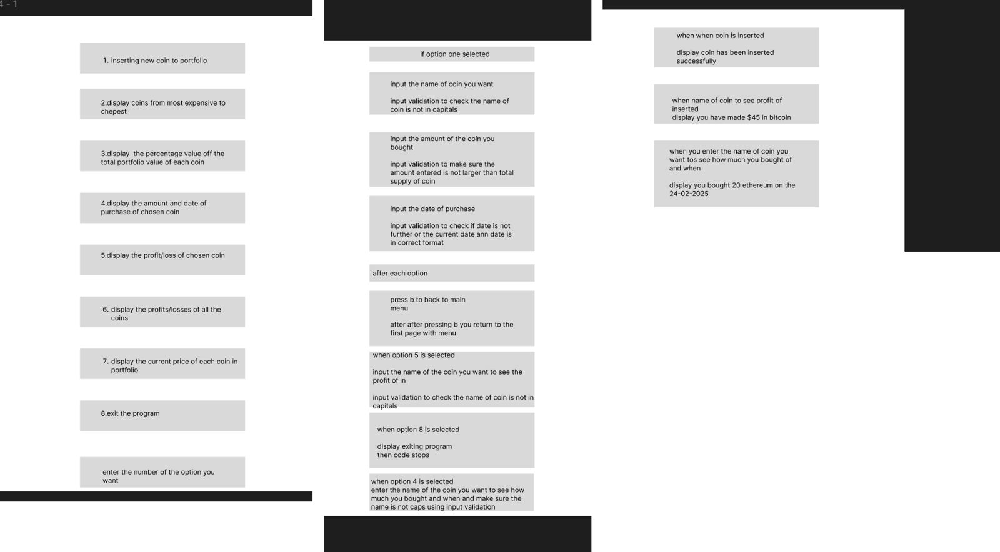

# my_Crypto_Tracker
My project is a crypto portfolio tool that allows user to find information about coins, profits on portfolio and the change in the prices per coin from purchase. with other searches user can make about their portfolio.

# Crypto Portfolio Tracker

A Python command-line app for tracking a cryptocurrency portfolio. Purchases are stored in a MySQL database, and live and historical prices come from the [CoinGecko API](https://www.coingecko.com/en/api). The app calculates profit and loss per coin, portfolio value and the percentage split between coins, using hand-written bubble sort and binary search algorithms.

It was originally built in 2025 as my SQA Advanced Higher Computing Science project (software design and development, integrated with a database).

## Features

- Add a purchase (coin, amount, date) to the database, with a list of the top 30 coins by market cap shown first. The price on the purchase date is fetched from CoinGecko and saved automatically.
- See the total value of the portfolio at current prices.
- See profit or loss for every coin, sorted from highest to lowest, or for one chosen coin, combining multiple purchases of the same coin.
- Look up every purchase of a coin: how much was bought and on which date.
- See what percentage of the portfolio's current value each coin makes up.
- List coins by current price, from most expensive to cheapest.
- Input validation on coin names, amounts and dates.
- Import purchases in bulk from a CSV file.

## Menu

```text
Cryptocurrency Portfolio Manager
1. Insert new coin
2. display the total portfolio value
3. find the profit of chosen coin
4. display distribution of all coins
5. display profits of all coins
6. find the amount bought at a certain date of a certain crypto.
7 show cryptos from most expensive to cheapest
8. exit the program
Choose an option:
```

After each option, the app asks you to press a key to return to the menu.

## How the parts fit together

The Python app reads and writes purchases in a MySQL table called `crypto`, stored in a cloud-hosted database so the portfolio is available from any computer, and requests current and historical prices from the CoinGecko REST API. Results are printed to the terminal.

## Use case diagram

UML use case diagram from the original project design.


## UI design

Original wireframes for the text menu and its input and output screens. The final menu differs from these in order and wording.



## Database design

| Field | Key | Type | Notes |
|---|---|---|---|
| `id` | Primary key | INT | Auto increment |
| `Crypto` | | VARCHAR(50) | CoinGecko coin id, lowercase |
| `Amount` | | DOUBLE | Quantity bought |
| `DateOfPurchase` | | VARCHAR(10) | `dd-mm-yyyy` |
| `price_at_purchase` | | DOUBLE | USD, fetched from the API |

Each row is one purchase, so the same coin can appear several times with different dates.

## How it works

### Loading the portfolio

On start-up, every row in the `crypto` table is loaded into a list of `cryptoRecord` objects (an array of records). Current prices for all coins are then requested from CoinGecko in a single call.

### Adding a purchase

The new purchase is inserted into the database first. Its historical price is then fetched from CoinGecko and written to the same row with an `UPDATE`, and both changes are committed together. If the price can't be fetched, the `INSERT` is rolled back, so no coin is saved without a price. After a successful save, the portfolio is reloaded so the new coin appears straight away.

### Profit and loss

Profit for each purchase is `(current price - price at purchase) × amount`. The results are grouped by coin in a dictionary, so several purchases of the same coin add up to one total.

### Searching and sorting

All sorting and searching uses hand-written algorithms:

- **Bubble sort** (O(n²)) orders the records by coin name, the profits from highest to lowest, and the coins by current price.
- **Binary search** (O(log n)) finds a coin by name in the name-sorted records, and finds a coin's profit in an alphabetical list of coins.

A binary search only works on a list sorted by the thing being searched for, so the records are sorted by name before searching. Because the list is sorted, every purchase of the same coin sits next to the one the search finds, so all of them can be shown.

## Input validation

- Coin names must be in lowercase, because CoinGecko coin ids are lowercase. Names with capitals are rejected and the user is asked again.
- The amount must be a number greater than 0, and less than the coin's total supply (fetched from CoinGecko) for coins that have one.
- Dates must be in `dd-mm-yyyy` format and must be before today.
- Invalid input shows an error message and asks again rather than crashing.

## Setup

**Requirements:** Python 3.7 or newer (tested on 3.14), a MySQL database (local or hosted), internet access for CoinGecko.

```bash
pip install -r requirements.txt
```

Copy `.env.example` to `.env` and fill in your database details. For a local database, the defaults in the example may already work. For a hosted database such as Aiven, also download its `ca.pem` certificate into the project folder and set `DB_SSL_CA=ca.pem` so the connection is encrypted. `.env` and `ca.pem` are listed in `.gitignore`, so they are never committed.

Create the table by running:

```bash
python setup_db.py
```

It runs this SQL, which you can also run yourself in a database tool:

```sql
CREATE TABLE IF NOT EXISTS crypto (
    id INT AUTO_INCREMENT PRIMARY KEY,
    Crypto VARCHAR(50) NOT NULL,
    Amount DOUBLE NOT NULL,
    DateOfPurchase VARCHAR(10) NOT NULL,
    price_at_purchase DOUBLE NULL
);
```

Optionally, load the sample purchases in `crypto_data.csv` into the database (prices are fetched from CoinGecko, which takes about a minute):

```bash
python import_csv.py crypto_data.csv
```

Then run the app:

```bash
python cryptoPortfolioTracker.py
```

## Project files

| File | Purpose |
|---|---|
| `cryptoPortfolioTracker.py` | The app: menu, calculations, sorting and searching, CoinGecko requests |
| `db.py` | Database connection, configured from `.env` |
| `setup_db.py` | Creates the `crypto` table |
| `import_csv.py` | Bulk-imports purchases from a CSV file into the database |
| `crypto_data.csv` | Sample purchases for trying the app |
| `.env.example` | Template for your database settings |
| `requirements.txt` | Python packages to install |

## Testing

The original version was tested against a written test plan with normal, extreme and invalid inputs, and with two user personas (a beginner and an experienced crypto investor).

| Area | How it was tested | Result |
|---|---|---|
| Loading records from the database | Compared printed records with the table contents | Pass |
| API integration | Breakpoints on the price-request functions, current and historical | Pass, but the free API tier sometimes timed out or hit rate limits |
| Adding a coin | Checked the new row and its historical price appeared in the database | Pass |
| Date validation | Wrong format (`dd/mm/yyyy`), today's date, future dates | Pass, after fixing a bug where dates were compared as text |
| Name validation | Coin names in capitals | Pass |
| Sorting and searching | Printed output before and after sorting; searched for existing and missing coins | Pass, after fixing a reversed comparison in one search |
| Menu | Every option, returning to the menu, exiting | Pass |

## Known limitations

- The CoinGecko free tier has rate limits, so requests can occasionally fail. If that happens when adding a purchase, nothing is saved and you can try again.
- Values are printed without rounding in some places, for example the total portfolio value.
- The interface is text only, and beginner testers found some terms (such as "distribution") unclear.
- There are no automated tests yet. All testing so far has been manual.

## Roadmap

- [x] Move to a hosted MySQL database so the portfolio is not tied to one computer
- [ ] Pie chart of portfolio distribution
- [ ] Graphical or web interface

## Tech stack

Python · MySQL · `mysql-connector-python` · `requests` · `python-dotenv` · CoinGecko REST API
